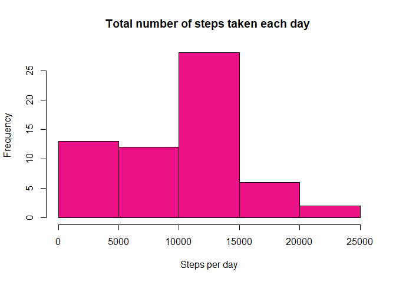
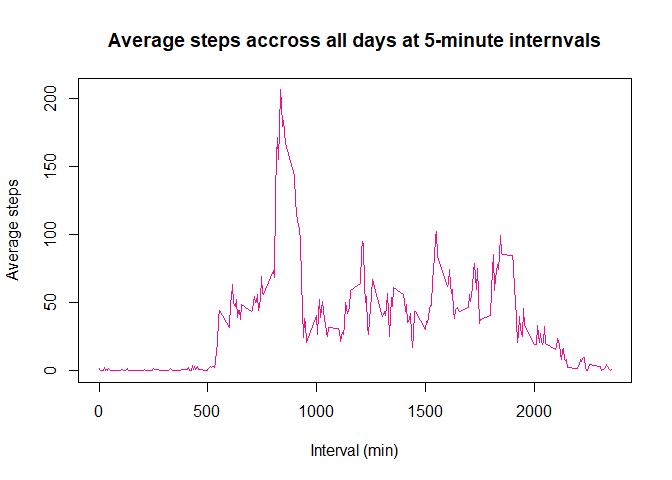
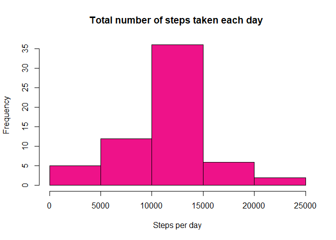
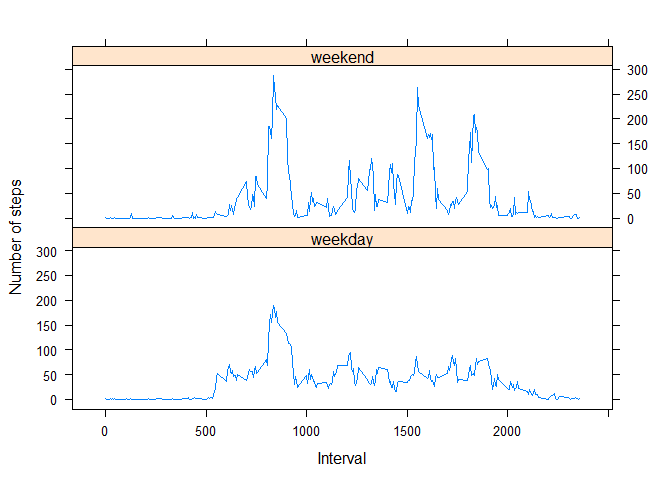

## Loading and preprocessing the data
This will load the data and packages to be used:

```r
#Load necessary libraries and read the data
library(dplyr)
library(lattice)
data = read.csv('activity.csv')
```


## What is mean total number of steps taken per day?

In this part of the assignment, the total steps taken per day (ignoring missing values) is calculated. Additionally, a histogram is plotted of the total number of steps taken each day. These are performed using the code below:


```r
        ## New data set with the total steps taken per day
totalsteps = data %>%
        select(steps,date) %>%
        group_by(date) %>%
        summarise(total_steps = sum(steps, na.rm = T))

        ##Histogram of the total steps p/day
with(totalsteps,(hist(total_steps, xlab = 'Steps per day', 
                      main = 'Total number of steps taken each day ',
                      col = 'deeppink2')))
```

<!-- -->

```
## $breaks
## [1]     0  5000 10000 15000 20000 25000
## 
## $counts
## [1] 13 12 28  6  2
## 
## $density
## [1] 4.262295e-05 3.934426e-05 9.180328e-05 1.967213e-05 6.557377e-06
## 
## $mids
## [1]  2500  7500 12500 17500 22500
## 
## $xname
## [1] "total_steps"
## 
## $equidist
## [1] TRUE
## 
## attr(,"class")
## [1] "histogram"
```

Afterwards, the mean and median of the total number of steps taken per day was calculated:


```r
        ##Mean and median
meansteps = mean(totalsteps$total_steps)
mediansteps = median(totalsteps$total_steps)
```

The mean steps per day was found to be **9354**, while the median is **10395**


## What is the average daily activity pattern?
For this, a time series plot of the 5-minute intervals and the average number of steps taken, averaged across all days (y-axis), was done.


```r
intervalav = data %>%
        group_by(interval) %>%
        summarise(average_steps = mean(steps, na.rm = T), .groups = 'keep')
with(intervalav,plot(interval,average_steps, type = 'l', lwd = 1, col = 'deeppink2',
                xlab = 'Interval (min)',
                ylab = 'Average steps', 
                main = 'Average steps accross all days at 5-minute internvals'))
```

<!-- -->

Based on this data and the using the code below, it was possible to determine the 5-minute interval that, on average across all the days in the dataset, contains the maximum number of steps. 

```r
maxinterval = intervalav$interval[which.max(intervalav$average_steps)]
maxstep = max(intervalav$average_steps)
```
The 5-minute interval with the average highest number of steps is **835**, with an average of **206.1698113** steps.


## Imputing missing values


```r
totalna = sum(is.na(data))
```

There are numerous NAs on the data (**2304**, to be precise), which may introduce bias into some calculations or summaries of the data. Therefore, it is desirable to fill in these variables. One option is to calculate the average number of steps on a specific interval accross all days and use this average to replace NAs. To do this, we can create a new dataset using the following code:


```r
datafull = data
for (i in 1:nrow(datafull)) {
        interval = datafull$interval[i]
        if (is.na(datafull$steps[i]))
                datafull$steps[i] = as.numeric(intervalav[intervalav$interval==interval,2])
}
        ## Validates there are no NAs in new dataset
newna = sum(is.na(datafull))
```

There are now **0** missing values in the new dataset, which is great!
Using this set, we can plot a new histogram of the total number of steps taken each day to see how it changed compared to the histogram plotted above.


```r
totalstepsfull = datafull %>%
        select(steps,date) %>%
        group_by(date) %>%
        summarise(total_steps = sum(steps))

with(totalstepsfull,(hist(total_steps, xlab = 'Steps per day', 
                      main = 'Total number of steps taken each day ',
                      col = 'deeppink2')))
```

<!-- -->

```
## $breaks
## [1]     0  5000 10000 15000 20000 25000
## 
## $counts
## [1]  5 12 36  6  2
## 
## $density
## [1] 1.639344e-05 3.934426e-05 1.180328e-04 1.967213e-05 6.557377e-06
## 
## $mids
## [1]  2500  7500 12500 17500 22500
## 
## $xname
## [1] "total_steps"
## 
## $equidist
## [1] TRUE
## 
## attr(,"class")
## [1] "histogram"
```
As expected, it differs. Do the mean and median differ, too, on this new dataset?


```r
meanstepsfull = mean(totalstepsfull$total_steps)
medianstepsfull = median(totalstepsfull$total_steps)
```

They do! The new mean is **10766**, while the new median is **10766**.


## Are there differences in activity patterns between weekdays and weekends?

The final part of this assignment is to see if there are differences in the behaviour comparing weekdays to weekends. For this, we must first determine whether a given day is a weekday or weekend day.


```r
week = datafull 
week = week %>%
        mutate(day = ifelse(as.POSIXlt(as.Date(week$date))$mday%%6 == 0,
                            "weekend", "weekday"))
```

We can now plot the 5-minute intervaland the average number of steps taken, averaged across all weekday or weekend days, to observe if there is a difference.


```r
weekintervalav = week 
weekintervalav = weekintervalav %>% 
        group_by(day,interval) %>%
        summarise(average_steps = mean(steps))

xyplot(average_steps~interval | as.factor(day), data = weekintervalav, 
       type = 'l', layout = c(1,2), ylab = 'Number of steps', xlab = 'Interval')
```

<!-- -->
